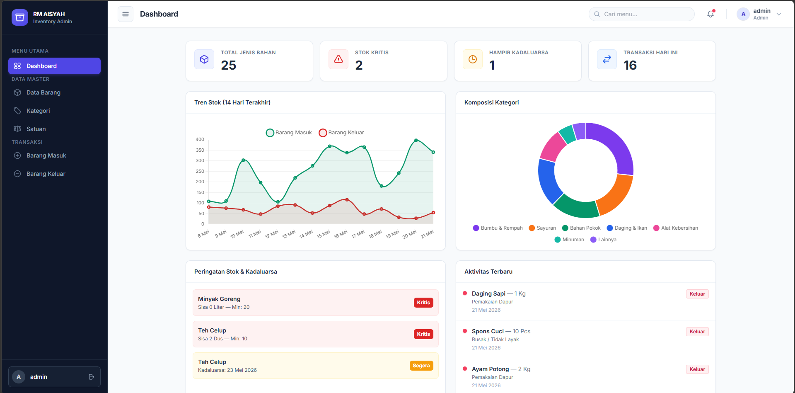
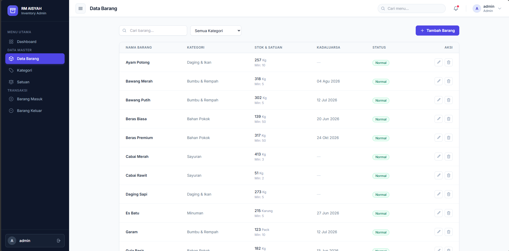
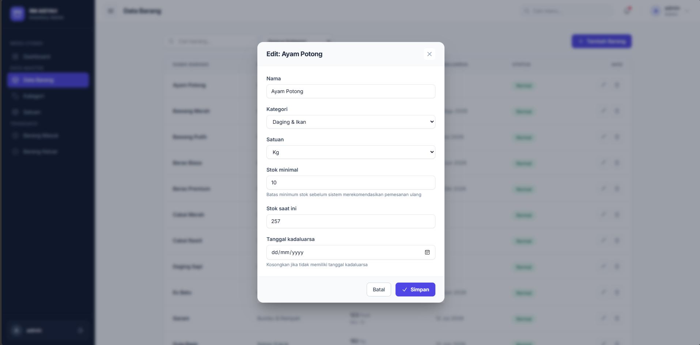

# 📦 RM Aisyah Inventory System


**Sistem Persediaan Terpusat & Modern** yang dirancang khusus untuk manajemen stok bahan baku Rumah Makan Aisyah Ngabang (Kalimantan Barat).

---

## 📖 Apa Ini & Bagaimana Cara Kerjanya?

**RM Aisyah Inventory** adalah aplikasi web internal untuk mencatat dan mengawasi sirkulasi barang di gudang/dapur restoran. Aplikasi ini memastikan restoran tidak pernah kehabisan bahan baku penting dan mencegah penggunaan bahan yang sudah kadaluarsa.

**Alur Kerja (Cara Kerja):**
1. **Data Master:** Admin mendaftarkan jenis barang, kategori, satuan ukur (Misal: Kg, Liter), dan mengatur **Stok Minimal** (Reorder Point) untuk setiap barang.
2. **Barang Masuk:** Setiap ada pembelian bahan baku dari *supplier*, admin mencatatnya di sistem. **Stok akan bertambah secara otomatis**.
3. **Barang Keluar:** Setiap hari saat dapur menggunakan bahan baku (atau jika ada barang rusak), admin mencatat pengeluaran. **Stok akan berkurang secara otomatis**.
4. **Monitoring & Alert:** Sistem secara cerdas akan memberikan peringatan (warna merah/kuning) di Dashboard jika ada barang yang stoknya sudah menyentuh batas kritis atau mendekati tanggal kadaluarsa (FIFO).

---

## 🚀 Fitur Unggulan

<div align="center">
  
  <br>
  <em>Tampilan Dashboard Utama dengan Grafik Tren dan Statistik Real-time</em>
</div>

- ✨ **Data-Dense Modern Dashboard**: Tampilan visual yang bersih dengan *glassmorphism*, diagram tren 14-hari, dan indikator KPI (Key Performance Indicator).
- 🔄 **Auto Stock Adjustment**: Validasi stok pintar. Stok diperbarui secara real-time saat transaksi disimpan, diedit, atau dibatalkan.
- 🚨 **Smart Alerts**: Peringatan stok kritis (Reorder Point) dan pemantauan barang kadaluarsa di layar utama.

<div align="center">
  
  <br>
  <em>Tampilan Data Barang dengan Indikator Status Kritis/Normal</em>
</div>

- ⚡ **AJAX-Powered (HTMX)**: Semua operasi tambah, edit, dan hapus barang menggunakan *Modal Popup* secara instan tanpa perlu memuat ulang halaman (*page reload*).

<div align="center">
  
  <br>
  <em>Tampilan Modal Popup saat Menambah/Mengubah Data</em>
</div>

- 📱 **Fully Responsive UI**: Desain antarmuka fleksibel yang dibangun dengan *Tailwind CSS*, nyaman dibuka dari laptop kasir maupun tablet.

---

## 🛠️ Teknologi yang Digunakan

- **Backend:** Python 3.12, Django 6.0
- **Database:** PostgreSQL (via `psycopg`)
- **Frontend:** HTML5, Tailwind CSS (via CDN), Chart.js
- **Icons:** Heroicons

---

## ⚙️ Persyaratan Sistem (Prerequisites)

Sebelum menginstal, pastikan komputer/server Anda sudah memiliki:
1. [Python 3.12+](https://www.python.org/downloads/) terinstal dan masuk ke *System PATH*.
2. [Git](https://git-scm.com/downloads) terinstal.
3. [PostgreSQL (versi 16 atau 17)](https://www.postgresql.org/download/) terinstal dan berjalan.

---

## 🖥️ Cara Instalasi & Menjalankan Aplikasi

Ikuti panduan langkah demi langkah di bawah ini untuk menjalankan aplikasi dari nol.

### Langkah 1: Clone Repository Github

Buka terminal/Command Prompt, lalu jalankan perintah berikut:

```bash
git clone https://github.com/xenuver/rmaisyah_inventory.git
cd rmaisyah_inventory
```

### Langkah 2: Setup Database PostgreSQL

Anda perlu membuat *database* kosong agar aplikasi bisa menyimpan data. 
Buka aplikasi terminal khusus PostgreSQL (`psql`) atau gunakan *pgAdmin*, lalu jalankan perintah SQL berikut:

```sql
-- Ganti password 'valen123' dengan password postgres Anda jika berbeda
CREATE DATABASE rmaisyah_inventory;
```
*(Catatan: Secara *default*, aplikasi terhubung ke database bernama `rmaisyah_inventory` dengan user `postgres` dan password `valen123`. Jika konfigurasi Anda berbeda, sesuaikan di dalam file `rmaisyah_inventory/settings.py` pada bagian `DATABASES`).*

### Langkah 3: Siapkan Virtual Environment & Dependencies

Sangat disarankan menggunakan virtual environment agar *library* tidak bentrok.

```powershell
# 1. Buat virtual environment bernama 'env'
python -m venv env

# 2. Aktifkan virtual environment (Untuk Windows)
.\env\Scripts\activate
# (Untuk Mac/Linux: source env/bin/activate)

# 3. Install semua dependencies yang dibutuhkan
pip install -r requirements.txt
```

### Langkah 4: Migrasi Database & Buat Akun Admin

Siapkan tabel-tabel di database yang baru saja Anda buat:

```powershell
# Lakukan migrasi database (membuat tabel)
python manage.py makemigrations
python manage.py migrate

# Buat akun admin utama untuk bisa login
python manage.py createsuperuser
```
*(Ikuti instruksi di layar untuk memasukkan Username, Email, dan Password admin).*

### Langkah 5: (Opsional) Masukkan Data Contoh (Seed Data)

Jika Anda ingin langsung melihat aplikasi dengan banyak data (Kategori, Barang, dan Riwayat Transaksi 30 hari terakhir) tanpa harus memasukkannya satu per satu secara manual, jalankan perintah ini:

```powershell
python manage.py seed_data
```

### Langkah 6: Jalankan Aplikasi! 🚀

Jalankan server lokal (Development Server):

```powershell
python manage.py runserver
```

Aplikasi sekarang sudah berjalan! Buka browser Anda dan kunjungi:  
👉 **http://127.0.0.1:8000/**

Gunakan **Username** dan **Password** yang Anda buat pada Langkah 4 untuk masuk ke dalam sistem. Selamat mengelola stok restoran dengan lebih mudah! 🥘
