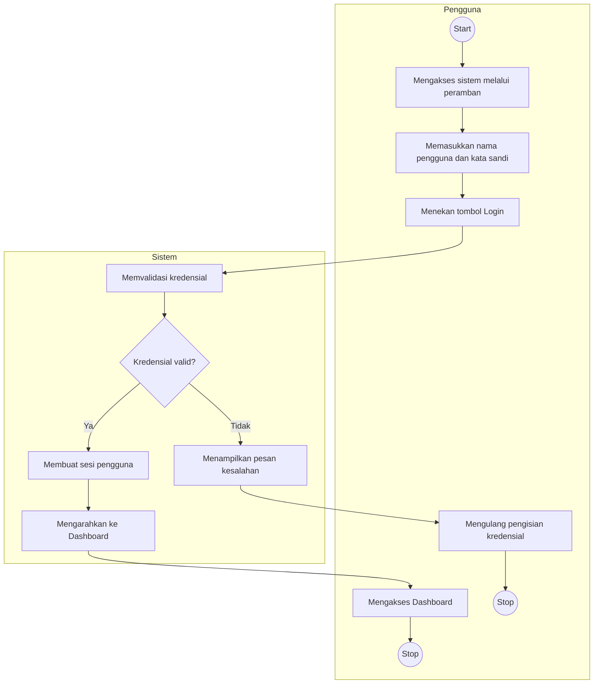
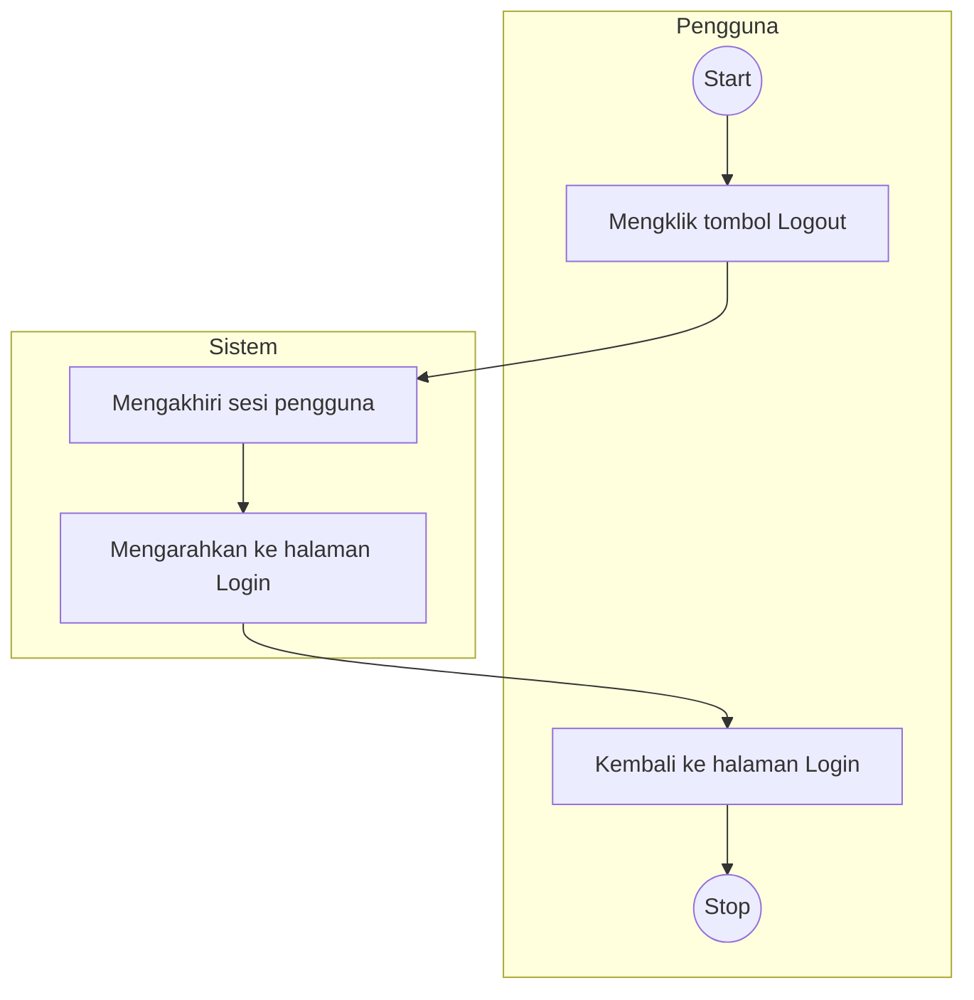
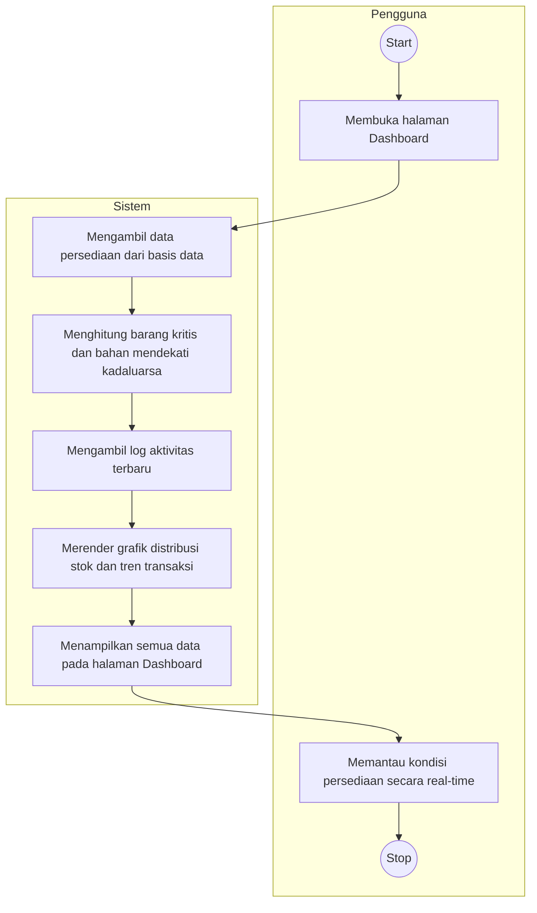
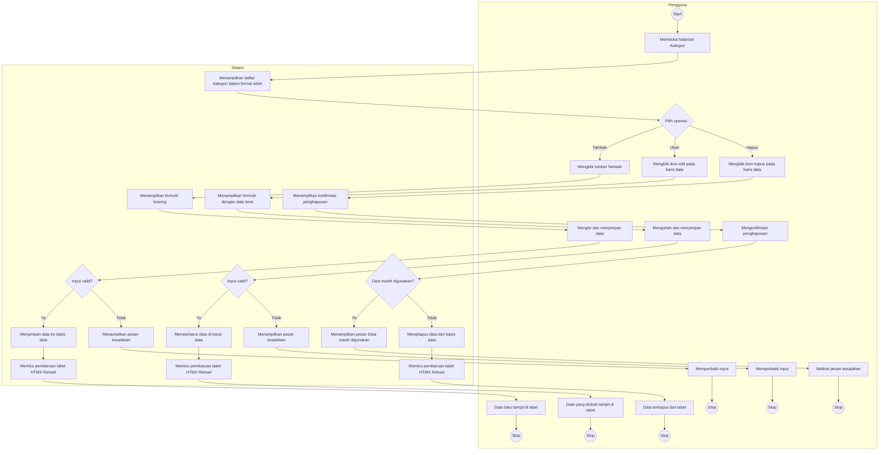
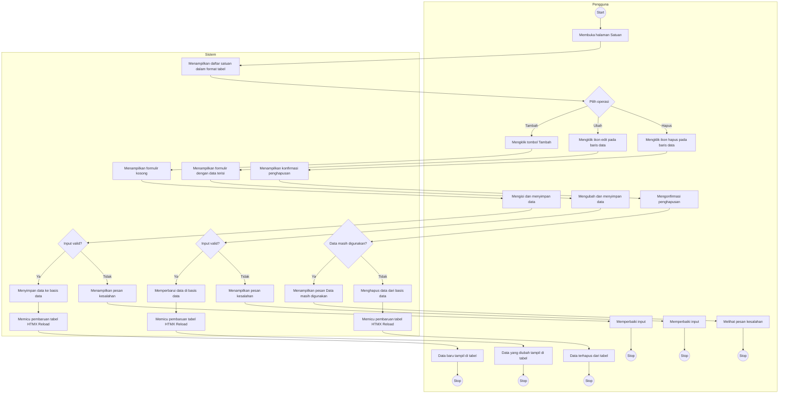
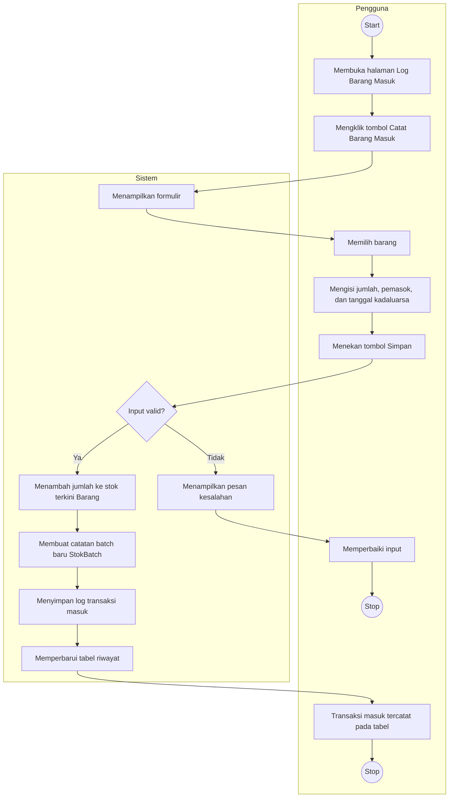
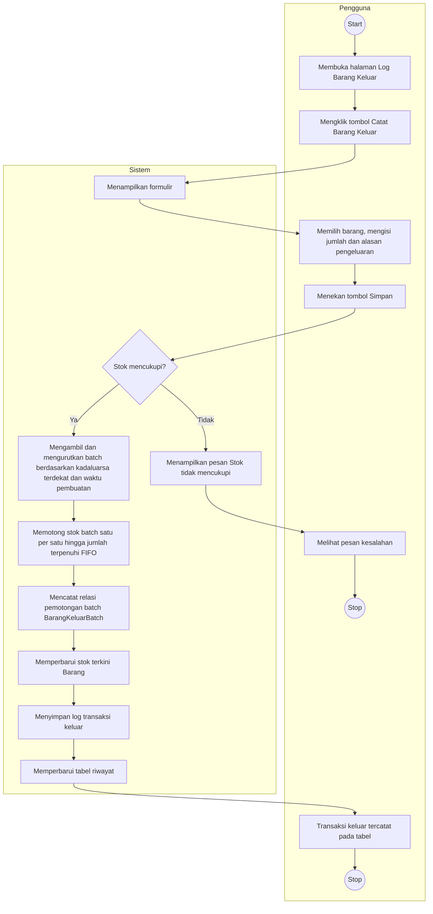
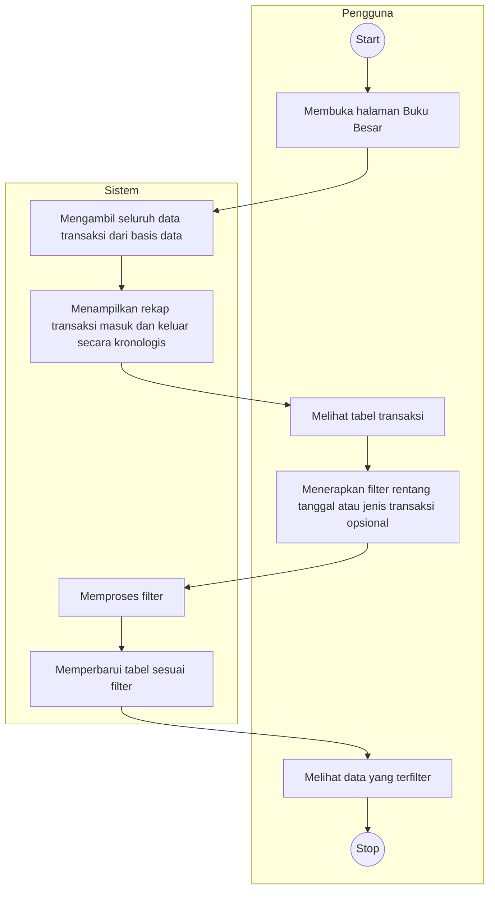
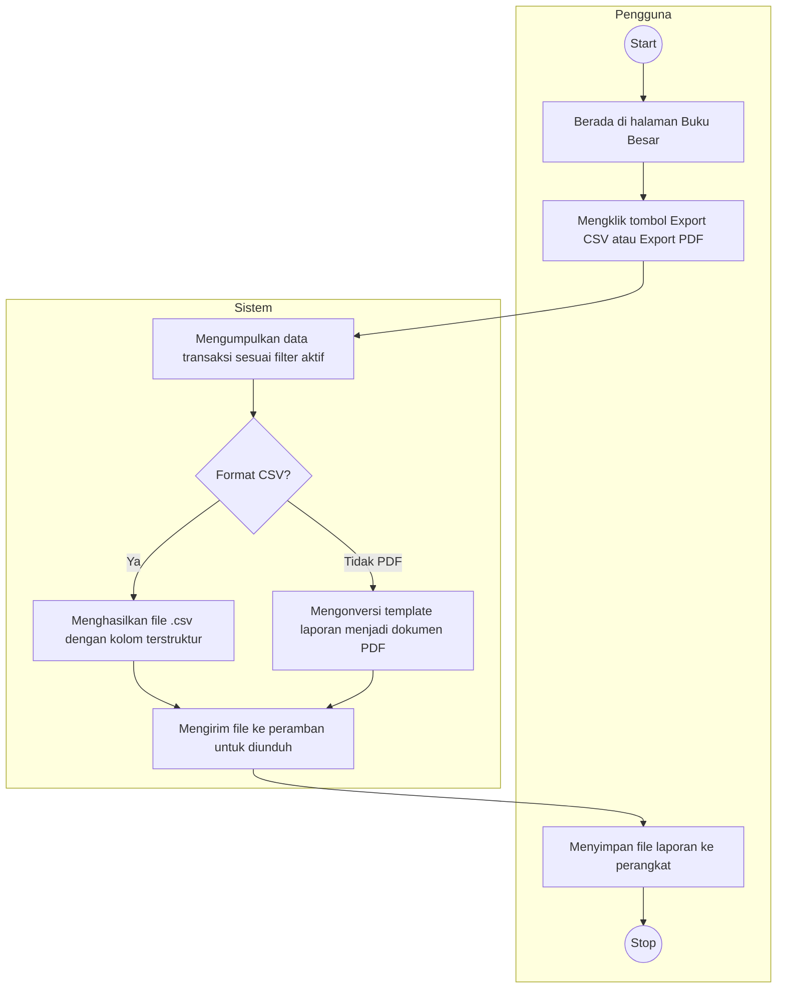

# Activity Diagram - Sistem Informasi Persediaan Rumah Makan Aisyah Ngabang

Paste setiap blok kode ke [mermaid.live](https://mermaid.live/) atau gunakan ekstensi Markdown untuk render diagram.

---

## 1. Activity Diagram Login

---

## 2. Activity Diagram Logout

---

## 3. Activity Diagram Lihat Dashboard

---

## 4. Activity Diagram Kelola Data Barang

---

## 5. Activity Diagram Kelola Kategori

---

## 6. Activity Diagram Kelola Satuan

---

## 7. Activity Diagram Catat Barang Masuk

---

## 8. Activity Diagram Catat Barang Keluar

---

## 9. Activity Diagram Lihat Buku Besar

---

## 10. Activity Diagram Ekspor Laporan

