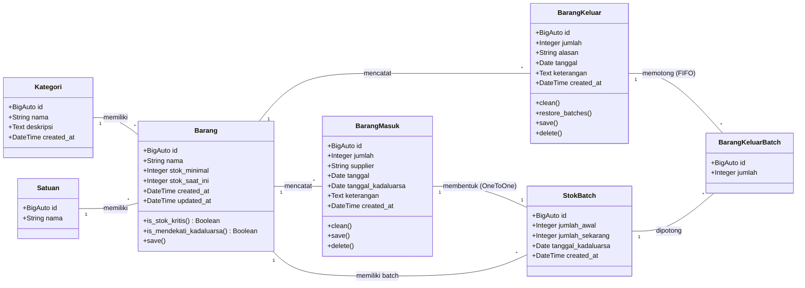

# Class Diagram - Sistem Informasi Persediaan Rumah Makan Aisyah Ngabang

Berikut adalah Class Diagram dari model data yang digunakan dalam sistem, dibuat menggunakan format Mermaid. Anda dapat menyalin blok kode di bawah ini ke [mermaid.live](https://mermaid.live) atau mempratinjaunya di editor yang mendukung Markdown Mermaid.

