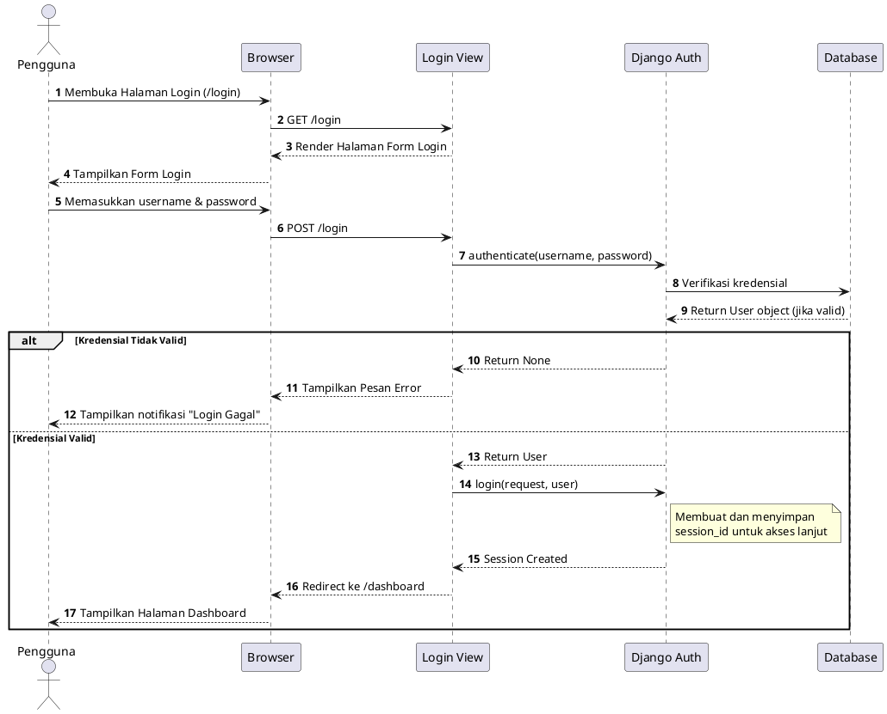
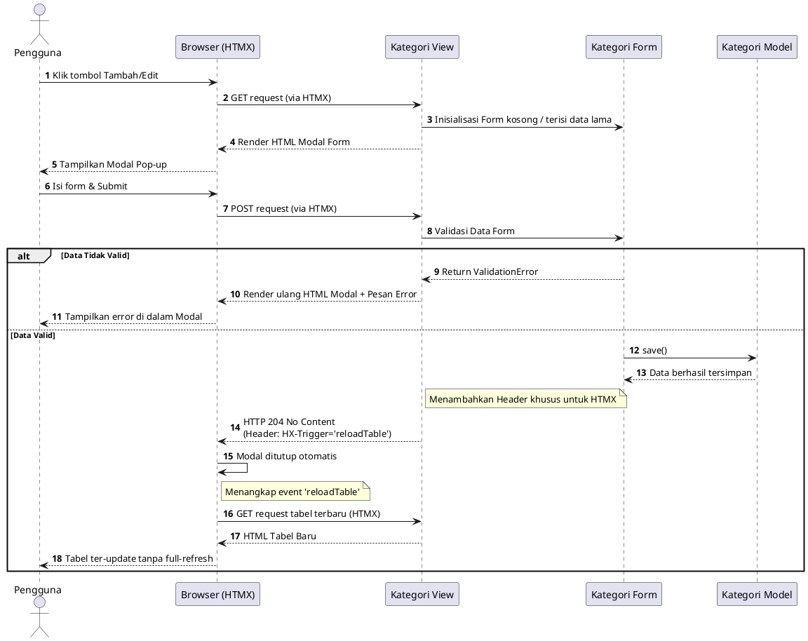
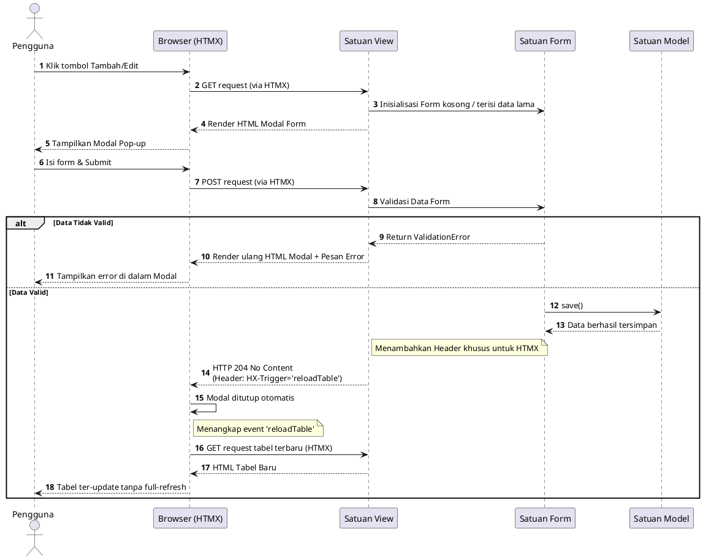
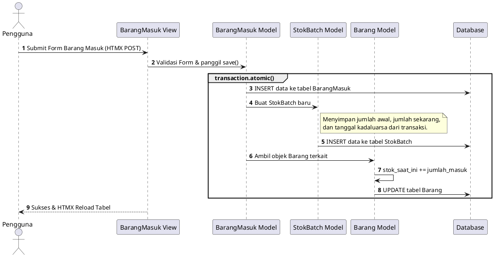
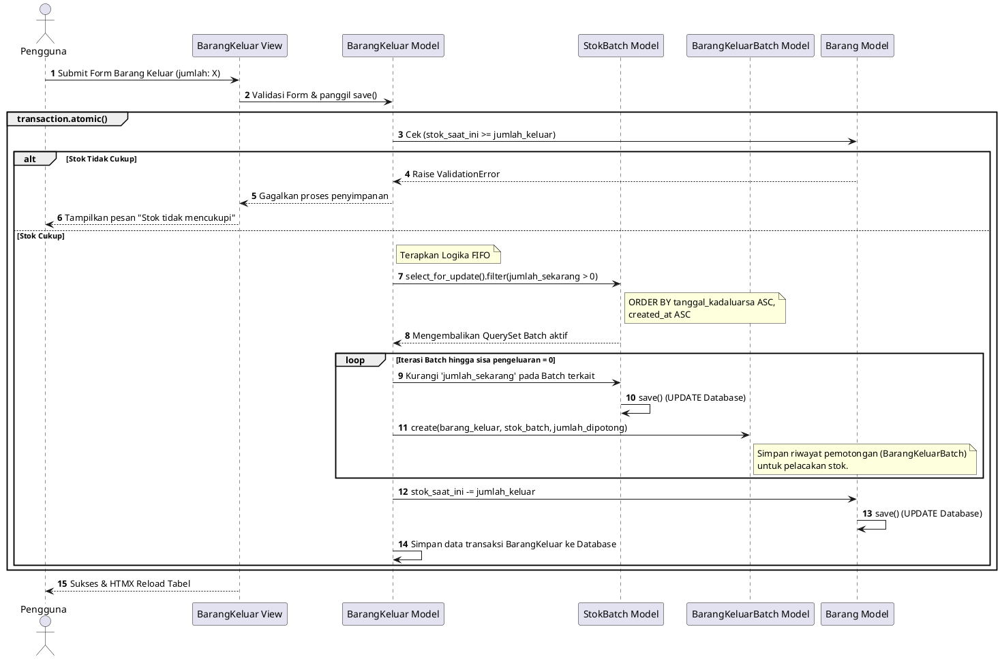
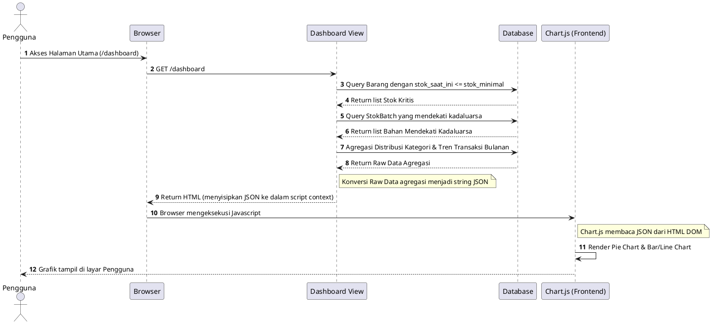
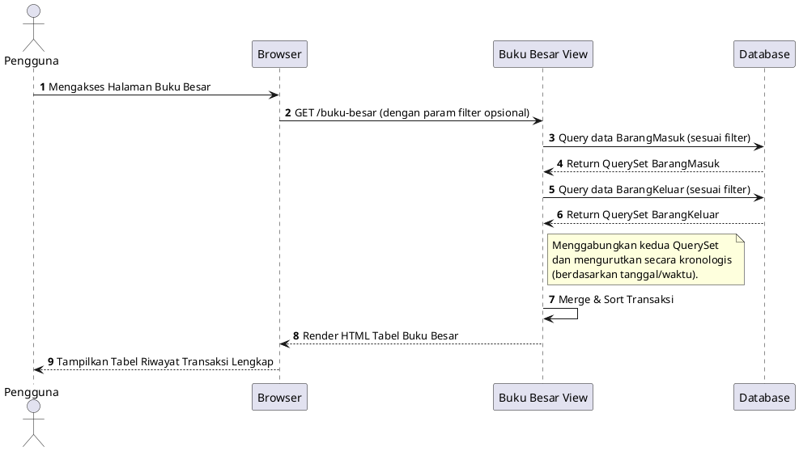
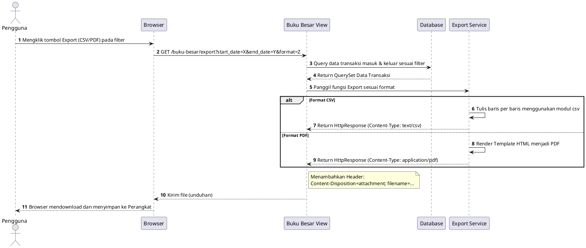

# Sequence Diagram - Sistem Informasi Persediaan Rumah Makan Aisyah Ngabang

Dokumen ini berisi Sequence Diagram (*Diagram Urutan*) yang dirancang khusus untuk mempermudah *programmer* memahami alur pertukaran data (terutama interaksi HTMX, logika *database transaction*, dan algoritma FIFO). Gunakan [plantuml.com/plantuml](https://www.plantuml.com/plantuml) atau ekstensi PlantUML untuk merendernya.

---

## 1. Alur Login Sistem
Menjelaskan bagaimana pengguna melakukan otentikasi (login) untuk masuk ke dalam aplikasi menggunakan verifikasi data dan pembuatan *session*.

---

## 2. Alur Kelola Data Barang
Menjelaskan bagaimana sistem memproses operasi CRUD (Create, Read, Update, Delete) pada entitas Barang menggunakan modal HTMX tanpa me-*refresh* seluruh halaman.

---

## 3. Alur Kelola Kategori
Menjelaskan bagaimana sistem memproses operasi CRUD (Create, Read, Update, Delete) pada entitas Kategori menggunakan modal HTMX tanpa me-*refresh* seluruh halaman.

---

## 4. Alur Kelola Satuan
Menjelaskan bagaimana sistem memproses operasi CRUD (Create, Read, Update, Delete) pada entitas Satuan menggunakan modal HTMX tanpa me-*refresh* seluruh halaman.

---

## 5. Alur Pencatatan Barang Masuk
Menjelaskan proses saat pengguna mencatat stok masuk. Sistem harus mencatat transaksi riwayat dan membuat `StokBatch` baru yang akan digunakan untuk FIFO.

---

## 6. Alur Pencatatan Barang Keluar (Algoritma FIFO)
Menjelaskan logika *First-In First-Out* (FIFO) yang sangat penting di sistem ini. Pengeluaran memprioritaskan batch yang paling dekat dengan tanggal kedaluwarsa atau yang dicatat paling awal.

---

## 7. Alur Memuat Dashboard (Pemrosesan Grafik & Analitik)
Menjelaskan interaksi antara *View* yang menyiapkan struktur JSON dan Javascript (*Chart.js*) di sisi klien yang merendernya.

---

## 8. Alur Melihat Laporan Buku Besar
Menjelaskan proses saat pengguna mengakses halaman Buku Besar, di mana sistem menarik log aktivitas masuk dan keluar, menggabungkannya, dan mengurutkannya secara kronologis berdasarkan filter tanggal.

---

## 9. Alur Unduh/Ekspor Laporan
Menjelaskan bagaimana sistem memproses hasil filter pada Buku Besar dan menghasilkan file berkas (CSV / PDF) yang kemudian diunduh (*download*) oleh pengguna.

